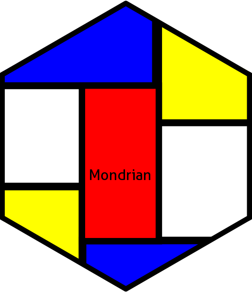

# Mondrian: Display the relative occurrence and co-occurrence of events in a sample 

[](http://cran.r-project.org/package=Mondrian)
[](https://cran.r-project.org/package=Mondrian)
[](https://github.com/lbbe-software/Mondrian/actions)

The unique function of the `Mondrian` package, named `mondrian`, allows representing in a single graph the relative occurrence and co-occurrence of events measured in a sample.
As examples, the package was applied to describe the occurrence and co-occurrence of different species of bacterial or viral symbionts infecting 
arthropods at the individual level. The graphics allows determining the prevalence of each symbiont and the patterns of multiple infections 
(i.e. how different symbionts share or not the same individual hosts). 
We named the package after the famous painter as the graphical output recalls Mondrian’s paintings.
  

# The package

The stable version of `Mondrian` can be installed from CRAN using:
```r
install.packages("Mondrian")
```

The development version of Mondrian can be installed from GitHub (`remotes` needed):
```r
if (!requireNamespace("remotes", quietly = TRUE))
   install.packages("remotes")
   
remotes::install_github("lbbe-software/Mondrian")
```

Finally load the package in your current R session with the following R command:
```r
library(Mondrian)
```


# The shiny app

A web application (a `Shiny` application) is available to use the functionalities of the `Mondrian` package in an interactive way.
In this application, two examples are shown. The user can also upload its own data and compute the `mondrian` function on it. 
The display output can then be saved.

`MondrianShiny` can be run on a R session, doing:
```r
shiny::runApp(system.file("MondrianShiny", package = "Mondrian"))
```

or online at:
<a href="http://lbbe-shiny.univ-lyon1.fr/Mondrian/inst/MondrianShiny/" target="_blank">http://lbbe-shiny.univ-lyon1.fr/Mondrian/inst/MondrianShiny/</a>

This shiny app is runing with the development version of `Mondrian`.


# Articles which use `Mondrian` functionalities

* *Competitive outcome of multiple infections in a behavior-manipulating virus/wasp interaction.*
Martinez et al. (2015). Ecology and Evolution, 5(24):5934–5945. doi: 10.1002/ece3.1749

* *Nuclear and cytoplasmic differentiation among Mediterranean populations of Bemisia tabaci: testing the biological relevance of cytotypes.* 
Terraz et al. (2014). Pest Management Science, 70:1503-1513. doi: 10.1002/ps.3792

* *Endosymbiont diversity among sibling weevil species competing for the same resource.*
Merville et al. (2013). BMC Evolutionary Biology, 13:28. doi: 10.1186/1471-2148-13-28

* *Distribution of Bemisia tabaci (Homoptera: Aleyrodidae) biotypes and their associated symbiotic bacteria on host plants in West Africa.*
Gnankiné et al. (2013). Insect Conservation and Diversity, 6(3):411-421. doi: 10.1111/j.1752-4598.2012.00206.x

* *Endosymbiont metacommunities, mtDNA diversity and the evolution of the Bemisia tabaci (Hemiptera: Aleyrodidae) species complex.*
Gueguen et al. (2010). Molecular Ecology, 19(19):4365-76. doi: 10.1111/j.1365-294X.2010.04775.x

